# spring_security
Springboot集成springSecurity

### 一丶遇到的问题
##### 把oracle的jar包导入到本地的maven仓库
1.在windows下cmd到maven的bin目录下
2.安装指定文件到本地仓库命令：mvn install:install-file
-DgroupId=<groupId>       : 设置项目代码的包名(一般用组织名)
-DartifactId=<artifactId> : 设置项目名或模块名 
-Dversion=1.0.0           : 版本号
-Dpackaging=jar           : 什么类型的文件(jar包)
-Dfile=<myfile.jar>       : 指定jar文件路径与文件名(同目录只需文件名)
安装命令实例：
mvn install:install-file -DgroupId=com.oracle -DartifactId=ojdbc7 -Dversion=11.2.0.4 -Dpackaging=jar -Dfile=C:/ojdbc7.jar 
### 目录结构
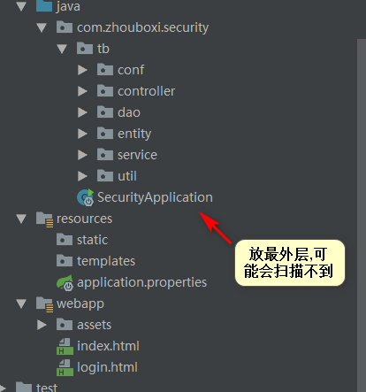
### pom 文件

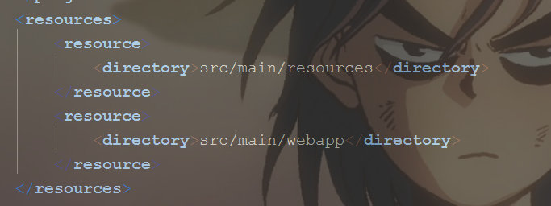
不要导入thymeleaf 不然默认请求/resources/templates
### 对请求进行前后缀添加和打印sql
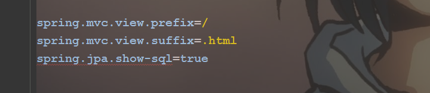
### 静态资源不拦截
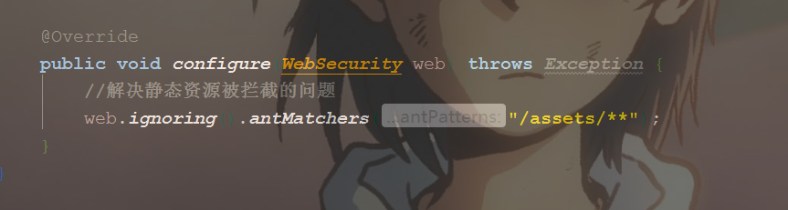
### 扫描包
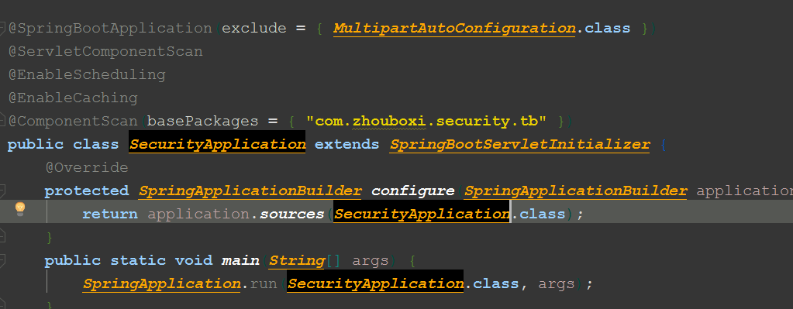
### 数据库设计
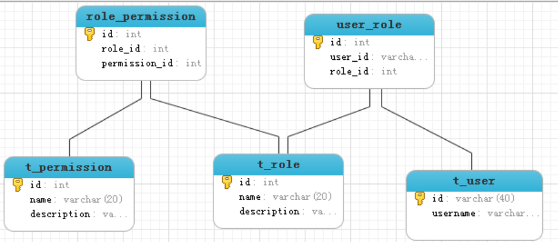
### JPA实现
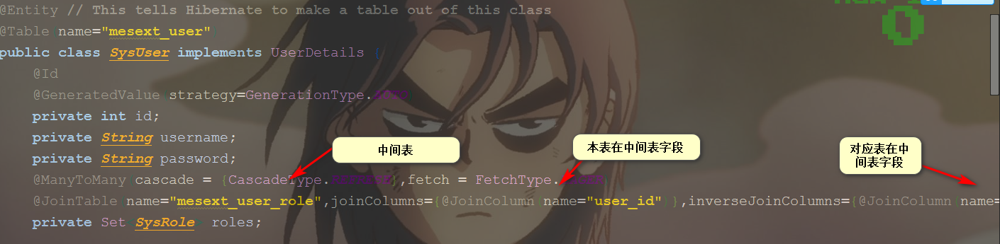
### 验证分析
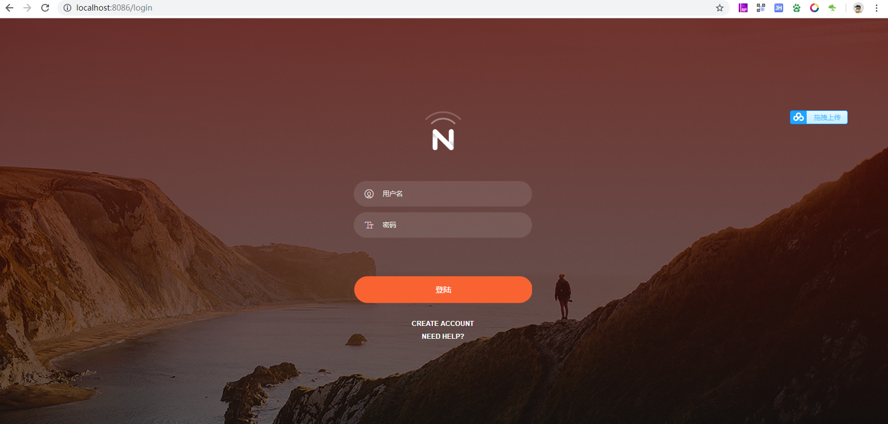
未登录前是不管如何请求都会转到.login请求
#### 源码分析
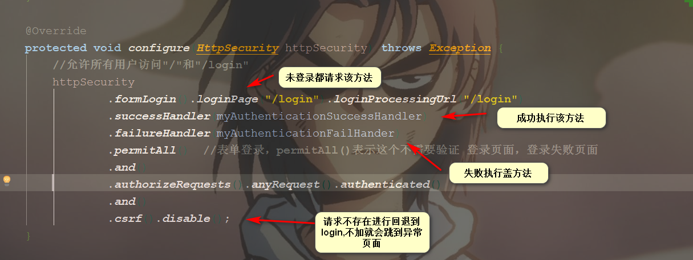
#### 验证过程

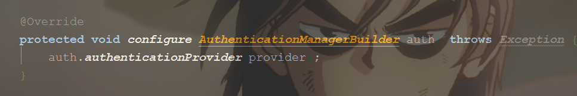

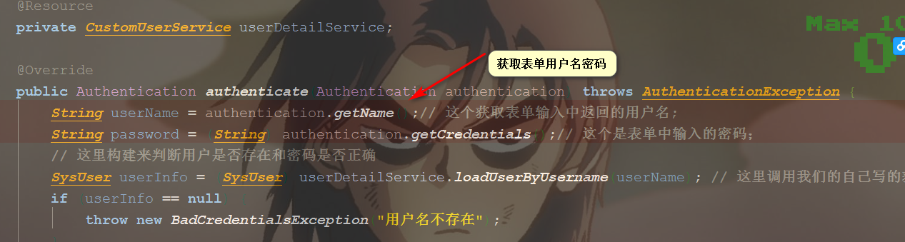

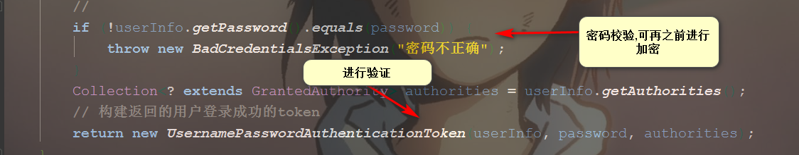

#### 获取登陆权限

#### 设置默认的请求封装
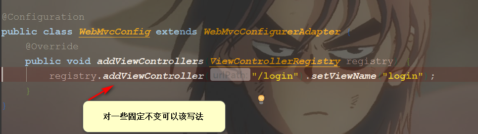

#### 请求设置权限
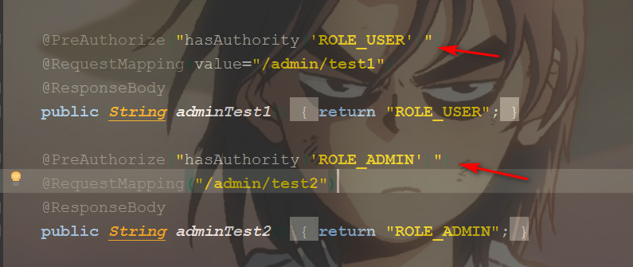

#### 效果图
登陆成功页面

无权限请求页面
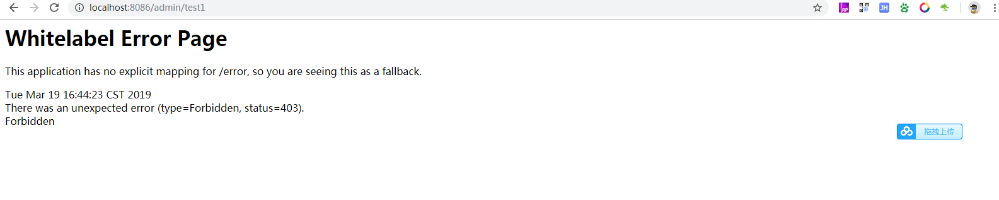
有权限请求页面
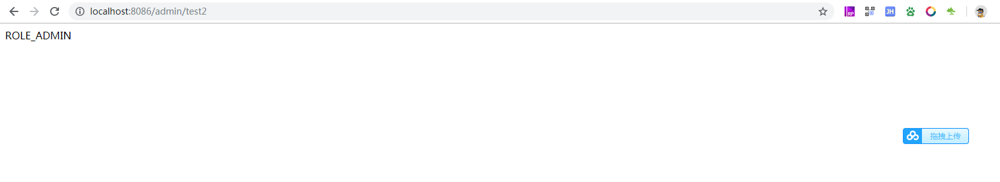